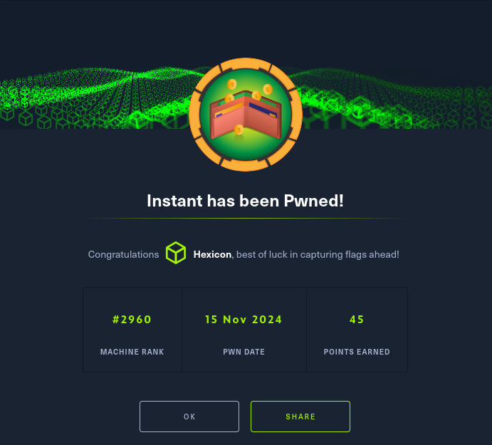

Instant is a medium-difficulty box that challenges users with Android app reverse engineering, API exploitation, and credential decryption.

## Summary

Enumeration leads us to an .apk file, which contains hardcoded API credentials and reveals hidden subdomains.

Using the Swagger API, we leak user information and abuse a path traversal vulnerability to extract Shirohige’s SSH key.

Inside the box, we find an SQLite database with hashed credentials, but cracking isn’t an option.

Privilege escalation involves discovering Solar-PuTTY stored credentials, which we decrypt to retrieve the root password.

# User

An initial Nmap scan reveals only two open ports. SSH and HTTP.


Navigating to the website, I found an .apk file available for download. I'll grab it and analyze its contents


I'll analyze the .apk file using jadx-gui, to see clearly whats inside and search for strings easily.


After a bit of searching, I've discovered two new subdomains and an admin token!

```
mywalletv1.instant.htb
swagger-ui.instant.htb
```

I'll add these two subdomains to my hostfile. I will begin my search with swagger-ui..


Its an API endpoint! If the admin token I've found in the apk works, I'll be able to make use of the admin functions.

I'll use the admin list users function, to see the users on the box and confirm that the token indeed works.


It worked! I can see that there are two users. Admin and shirohige. I'll try to get the credentials of shirohige via other functions of the API.

with the function "admin read log", I can read log files everywhere on the machine. However, after trying to abuse path traversal, I discovered that we are not limited to reading only .log files.
I tried to scout for shirohige's credentials, but found nothing. Instead, I decided to try and hunt for his SSH key, so that I can SSH into the machine without his credentials.


It worked! Im now able to use this key to log in as shirohige into the box and claim the user flag!

```
chmod 600 id_rsa
```
The key cannot be accessible to others, otherwise SSH will throw an error. I'll change the permissions.


## Privilege escalation

After looking around for a while, I've found a database file deep inside shirohige's home folder.


I'll copy it over to my machine using scp.

```
scp -i id_rsa shirohige@10.10.11.37:/home/shirohige/projects/mywallet/Instant-Api/mywallet/instance/instant.db .
```
Inside there are two users. Shirohige and admin, with hashes! However, admin's hash will not crack due to it being strongly hashed.


Time to dive back in as shirohige! After a little bit of searching, I've stumbled upon an intersting file.


Looking at it on my machine, it seems to be encrypted.


Maybe there is a tool online that could help me decrypt this? remember, it was in a folder named "Solar-PuTTY".

Indeed! There is a tool that could help. I'll try it out against the .dat file.

https://github.com/Dimont-Gattsu/SolarPuttyDecrypterPy.git


It cracked fast! Lets take a look at the outfile.


I got the root credentials! Now, I cant just SSH as the root user directly, but I can use su as shirohige inside the machine and login as root that way.


Rooted!
